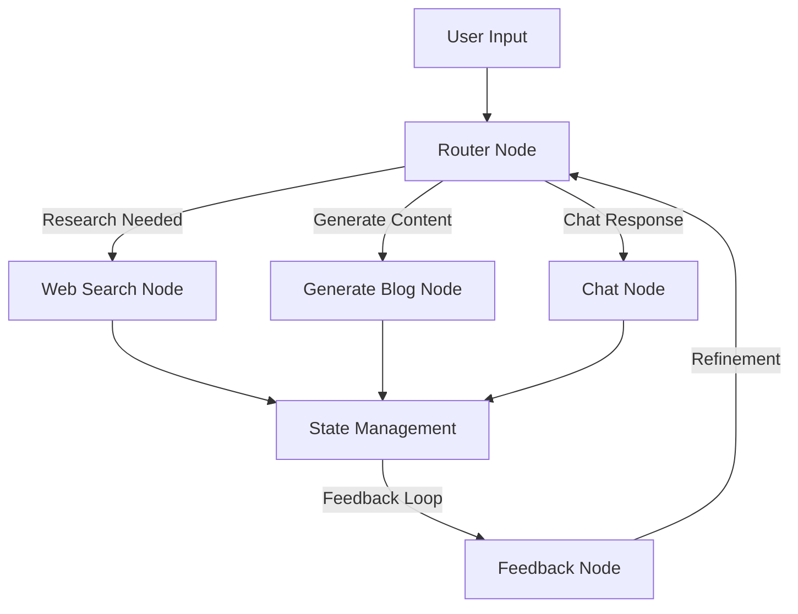
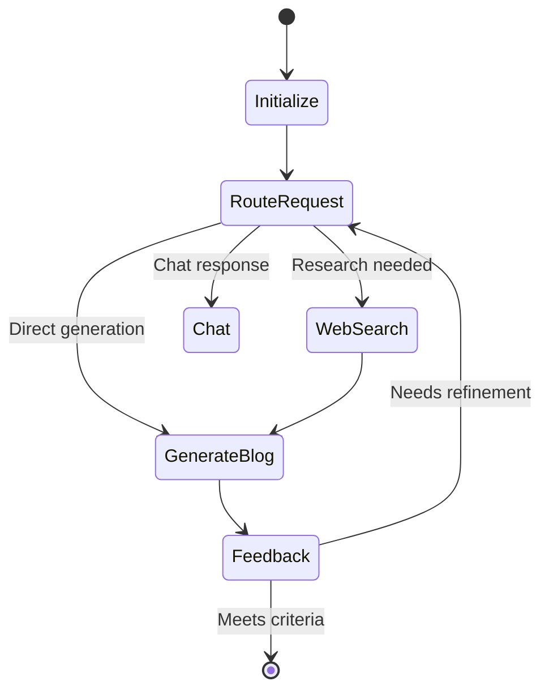

# Blog Post Generator

A modern, AI-powered blog content generation system consisting of an intelligent agent for content creation and a sleek web interface. This project combines advanced LLM capabilities with a responsive UI to help users generate engaging blog content.

## 🌟 Key Features

- 🤖 AI-powered blog post generation with multi-step processing
- 🔍 Automated web research and content refinement
- 💻 Real-time content preview with modern UI
- 🎨 Clean, responsive interface with dark mode support
- 📱 Mobile-first design approach
- 🔄 Sophisticated state management
- ⚡ High-performance development setup

## 🏗️ System Architecture

The project consists of two main components:

### Agent Architecture


### Processing Flow


## 💻 Tech Stack

### UI Component
- **Framework:** Next.js 15 with App Router
- **Language:** TypeScript
- **Styling:** Tailwind CSS, Shadcn UI, Radix UI
- **State Management:** CopilotKit
- **Package Manager:** pnpm
- **Development:** Turbopack

### Agent Component
- **Language:** Python 3.9+
- **Framework:** LangGraph
- **Package Manager:** UV
- **Key Libraries:** LangChain, OpenAI

## 🚀 Getting Started

### Prerequisites
- Node.js 18+
- Python 3.9+
- pnpm (for UI)
- UV (for Agent)

### UI Setup

1. Navigate to the UI directory:
   ```bash
   cd ui
   ```

2. Install dependencies:
   ```bash
   pnpm install
   ```

3. Configure environment:
   Create `.env.local` with:
   ```
   OPENAI_API_KEY=your_key_here
   REMOTE_ACTION_URL=http://localhost:8000/copilotkit
   ```

4. Start development server:
   ```bash
   pnpm dev
   ```

### Agent Setup

1. Navigate to the agent directory:
   ```bash
   cd agent
   ```

2. Create and activate virtual environment:
   ```bash
   uv venv
   source .venv/bin/activate  # Unix/macOS
   .venv\Scripts\activate     # Windows
   ```

3. Install dependencies:
   ```bash
   uv sync
   ```

4. Configure environment:
   Create `.env` with required API keys

5. Start the agent:
   ```bash
   poetry run app
   ```

## 📁 Project Structure

```
blog-post-generator/
├── ui/
│   ├── src/
│   │   ├── app/           # Next.js pages
│   │   ├── components/    # UI components
│   │   ├── types/        # TypeScript types
│   │   └── styles/       # Global styles
│   └── public/           # Static assets
│
├── agent/
│   ├── src/
│   │   ├── nodes/        # Processing nodes
│   │   ├── state/        # State management
│   │   ├── schema/       # Data schemas
│   │   ├── utils/        # Utilities
│   │   └── graph/        # Graph configs
│   └── main.py          # Entry point
```

## 🛠️ Agent Components

### Processing Nodes
- **Router Node:** Determines processing path based on input
- **Web Search Node:** Performs research using search APIs
- **Generate Blog Node:** Creates content using LLMs
- **Feedback Node:** Evaluates and suggests improvements
- **Chat Node:** Handles direct user interactions

## 🔄 Development Workflow

1. Start both UI and Agent servers
2. Access the UI at http://localhost:3000
3. Input your blog topic
4. The system will:
   - Research relevant content
   - Generate initial draft
   - Refine based on feedback
   - Present final content

## 📝 License

This project is licensed under the MIT License - see the LICENSE file for details.

## 🤝 Contributing

Contributions are welcome! Please read our contributing guidelines for details on our code of conduct and the process for submitting pull requests.
