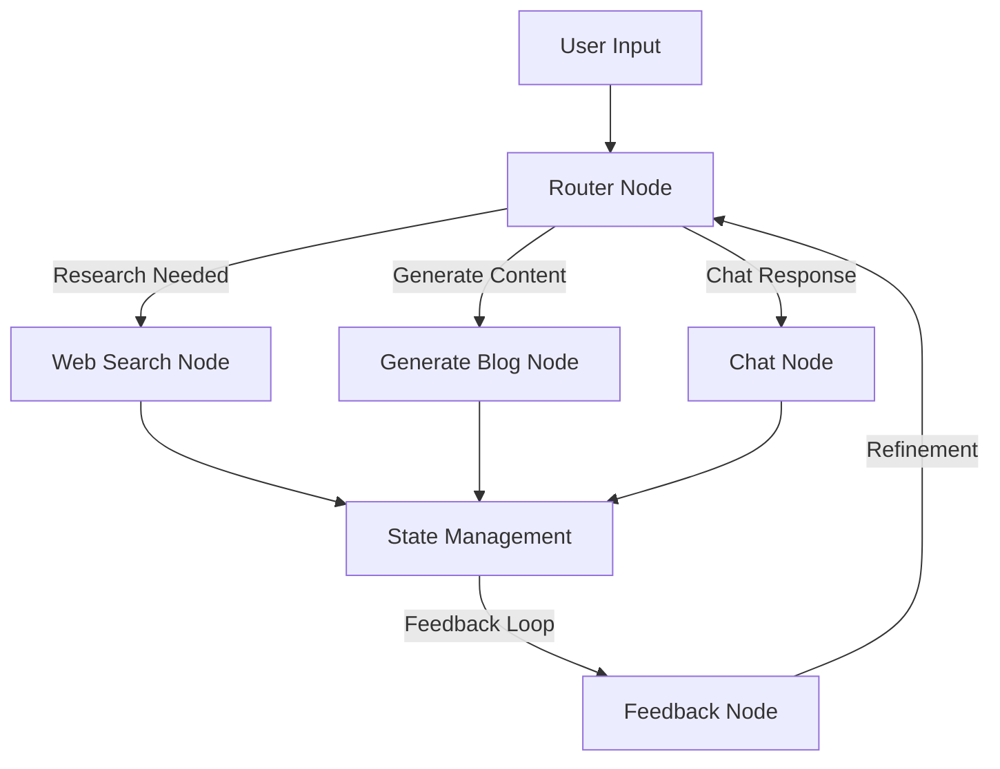
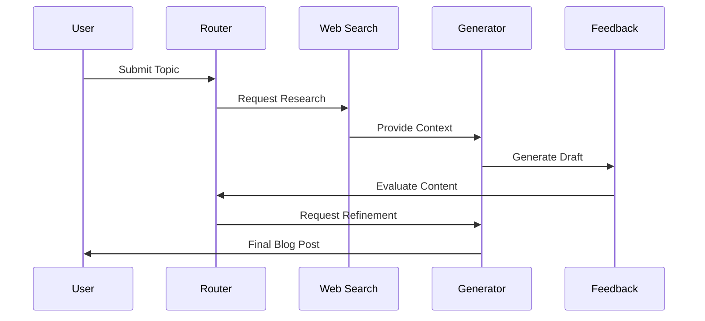
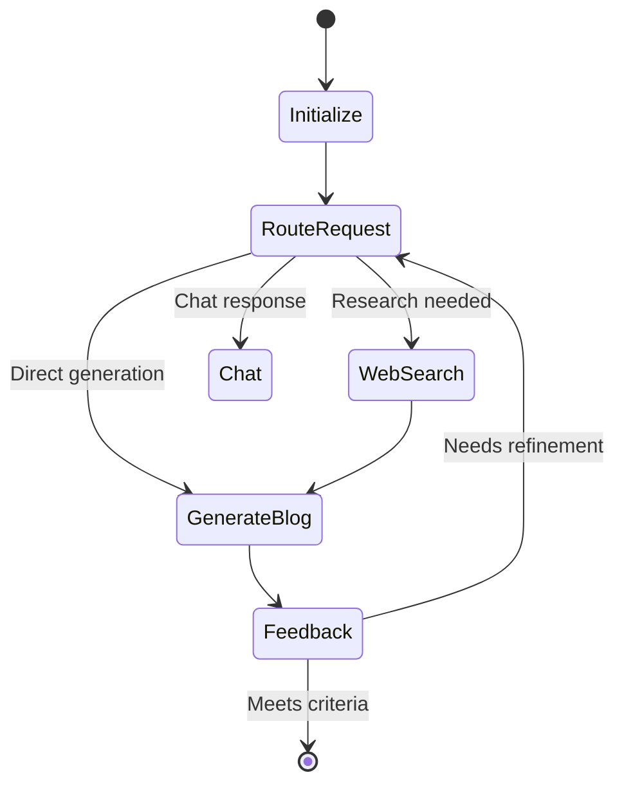

# Blog Post Generator Agent

An intelligent agent that generates high-quality blog posts using LangGraph and various LLM capabilities. The agent performs web research, content generation, and iterative refinement to create engaging blog content.

## 🌟 Features

- Automated web research on given topics
- Intelligent content generation using GPT models
- Multi-step processing pipeline with feedback loops
- State management for complex workflows
- Modular node-based architecture

## 🏗️ Architecture

The project follows a modular architecture using LangGraph nodes for different processing stages.



### Component Flow



## 🚀 Getting Started

### Prerequisites

- Python 3.9+
- UV package manager

### Installation

1. Clone the repository:
```bash
git clone git@github.com:shahshrey/blog-post-generator-agent.git
cd blog-post-generator
```

2. Install dependencies using UV:
```bash
uv venv
source .venv/bin/activate  # On Unix/macOS
.venv\Scripts\activate     # On Windows
uv sync
```

3. Run the agent:
```bash
cd agent
cp .env.example .env
poetry run app
```

4. Run the UI
```bash
cd ui
cp .env.local.example .env.local
cp .env.production.example .env.production
pnpm install
pnpm dev
```

5. Deployed version:
https://blog-post-generator-indol.vercel.app/

Note: The deplyed version might take a while to load the first time due to cold start and might also lag due to the free plan of Vercel and railway.

6. Send a message to the chatbot like: 
```
Write a blog post on the topic of "The impact of AI on the future of work"
```

## 📁 Project Structure

```
blog-post-generator/
├── src/
│   ├── nodes/              # Processing nodes
│   │   ├── router_node.py      # Routing logic
│   │   ├── web_search_node.py  # Web research
│   │   ├── generate_blog_node.py # Content generation
│   │   ├── feedback_node.py    # Content evaluation
│   │   └── chat_node.py        # Chat interactions
│   ├── state/              # State management
│   ├── schema/             # Data schemas
│   ├── utils/              # Utility functions
│   └── graph/              # Graph configurations
├── main.py                 # Entry point
└── pyproject.toml          # Project configuration
```

## 🔄 Processing Flow



## 🛠️ Node Descriptions

- **Router Node**: Determines the processing path based on input
- **Web Search Node**: Performs research using search APIs
- **Generate Blog Node**: Creates blog content using LLMs
- **Feedback Node**: Evaluates and suggests improvements
- **Chat Node**: Handles direct interactions

## 🤖 Prompt Engineering Approach

My prompt engineering strategy follows a systematic workflow:

1. **Query Analysis**
   - Break down user topics into discrete, searchable questions
   - Identify key research areas and knowledge gaps

2. **Research Phase**
   - Execute targeted web searches for each sub-question
   - Aggregate and validate information from multiple sources

3. **Content Generation**
   - Transform research into structured blog content
   - Apply Chain-of-Thought reasoning for logical flow
   - Segment prompts into clear sections (Context, Requirements, Examples)

4. **Iterative Refinement**
   - Collect user feedback on generated content
   - Implement targeted improvements based on feedback
   - Validate changes against original requirements

5. **Quality Assurance**
   - Use LLM-based evaluation to assess content quality
   - Verify alignment with user intent and requirements
   - Ensure factual accuracy and coherence

## 🧪 Testing

### Running Tests

Run the test using:
```bash
python test.py
```

### Test Coverage

The test covers:
- Blog post generation workflow
- Content validation and feedback
- State management

Key test cases:
- Generation with default prompts
- Custom topic generation
- Validation of generated content
- Error handling for API failures
- State persistence and recovery
- Edge cases in content processing

Testing Approach:
- LLM as judge, we can add a lot more validations
- Structured outputs validation
- We can incorporate pytest and parameterize the tests for different scenarios and different prompts as well

## Design Decisions
- I chose CopilotKit to maintain shared state between the frontend and agent components
- Next.js was selected as it is LLM friendly and make it easier to use Cursor for the front-end development
- Blog posts are only rendered after full generation, simplifying frontend state management
- The agent is aware of the frontend state changes to process user feedback effectively
- A conversational chatbot interface provides natural user interaction rather than traditional UI controls

## Edge Cases
- The Router node analyzes user intent and directs requests to specialized nodes, enabling a single agent to handle multiple use cases. While a React-style agent approach was considered, the router-based architecture provides better separation of concerns and workflow control for this application. This helps handle edge cases better.
