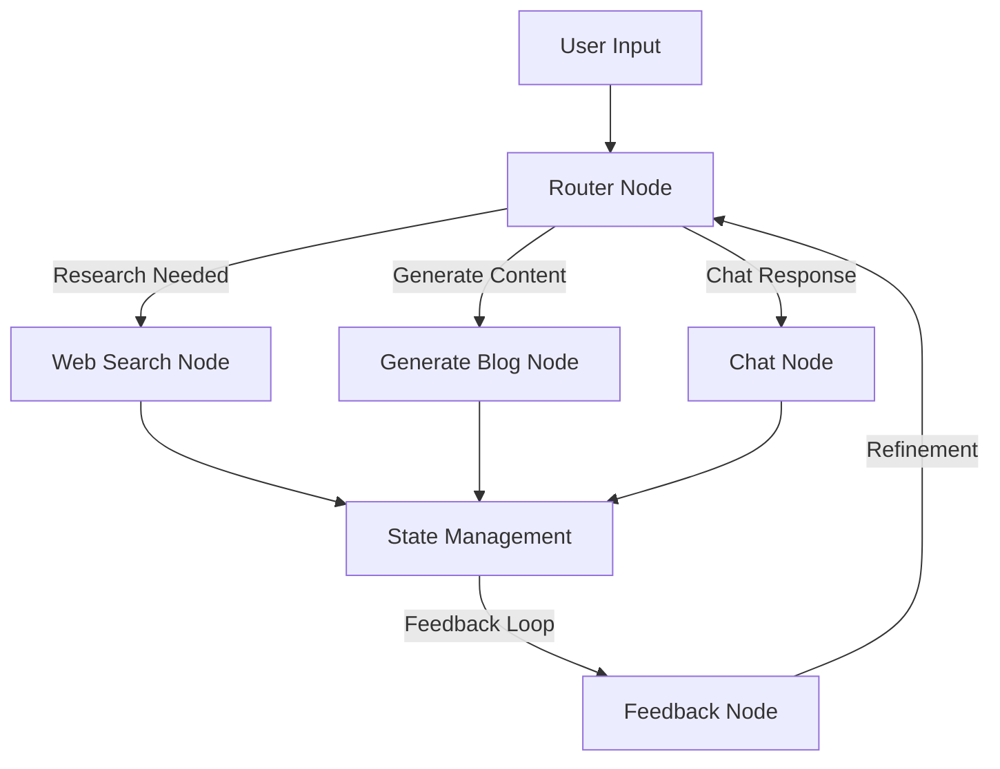
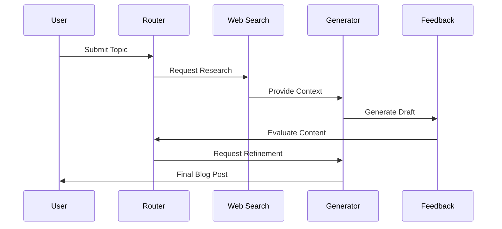
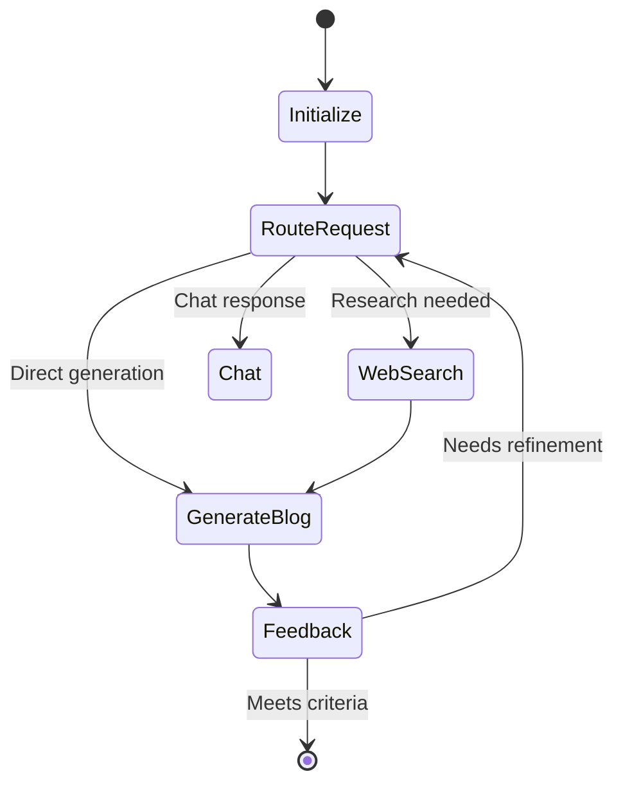

# Blog Post Generator Agent

An intelligent agent that generates high-quality blog posts using LangGraph and various LLM capabilities. The agent performs web research, content generation, and iterative refinement to create engaging blog content.

## 🌟 Features

- Automated web research on given topics
- Intelligent content generation using GPT models
- Multi-step processing pipeline with feedback loops
- State management for complex workflows
- Modular node-based architecture

## 🏗️ Architecture

The project follows a modular architecture using LangGraph nodes for different processing stages.



### Component Flow



## 🚀 Getting Started

### Prerequisites

- Python 3.9+
- UV package manager

### Installation

1. Clone the repository:
```bash
git clone <repository-url>
cd blog-post-generator
```

2. Install dependencies using UV:
```bash
uv venv
source .venv/bin/activate  # On Unix/macOS
.venv\Scripts\activate     # On Windows
uv sync
```

3. Set up environment variables:
Create a `.env` file with required API keys (do not commit this file)

4. Run the agent:
```bash
poetry run app
```

## 📁 Project Structure

```
blog-post-generator/
├── src/
│   ├── nodes/              # Processing nodes
│   │   ├── router_node.py      # Routing logic
│   │   ├── web_search_node.py  # Web research
│   │   ├── generate_blog_node.py # Content generation
│   │   ├── feedback_node.py    # Content evaluation
│   │   └── chat_node.py        # Chat interactions
│   ├── state/              # State management
│   ├── schema/             # Data schemas
│   ├── utils/              # Utility functions
│   └── graph/              # Graph configurations
├── main.py                 # Entry point
└── pyproject.toml          # Project configuration
```

## 🔄 Processing Flow



## 🛠️ Node Descriptions

- **Router Node**: Determines the processing path based on input
- **Web Search Node**: Performs research using search APIs
- **Generate Blog Node**: Creates blog content using LLMs
- **Feedback Node**: Evaluates and suggests improvements
- **Chat Node**: Handles direct interactions
